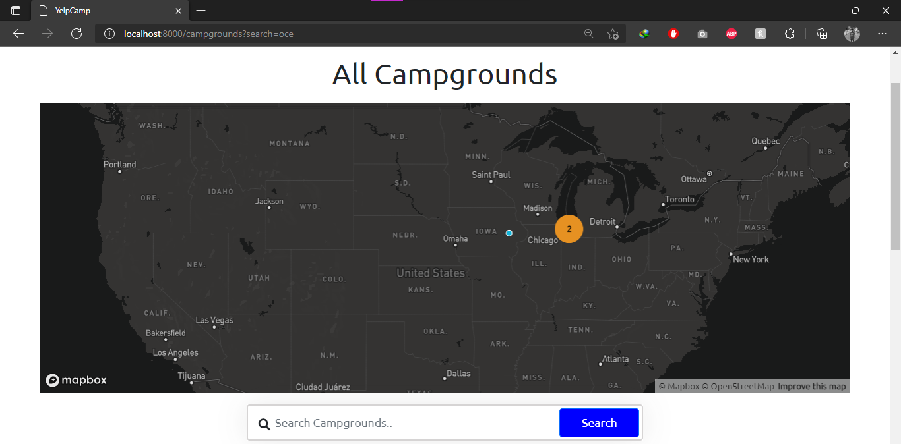
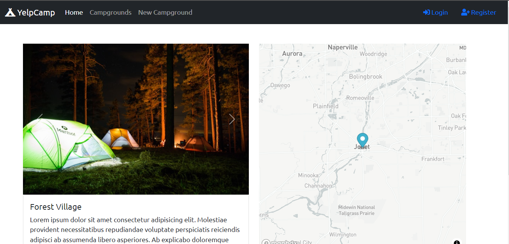
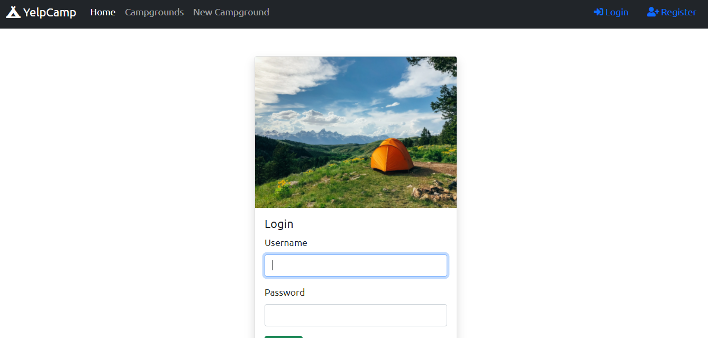

# YelpCamp

**💻Live (https://yelp-camp-v.herokuapp.com/)**
<br/>

**👉[Older_Version](https://github.com/uppli29/yelpcamp) of the course project **
<br/>
<br/>

  <br/><br/>
 <br/><br/>
 <br/><br/>
YelpCamp is a website where users can create and review campgrounds. In order to review or create a campground, you must have an account. This project was part of Colt Steele's updated Web Developer Bootcamp course on [Udemy](https://www.udemy.com/course/the-web-developer-bootcamp/).  


This project was created using Node.js, Express, MongoDB, and Bootstrap. Passport.js was used to handle authentication.  

## Features
* Users can create, edit, and remove campgrounds
* Users can review campgrounds once, and edit or remove their review
* Search campground by name or location


## Run it locally
1. Install [mongodb](https://www.mongodb.com/)
2. Create a cloudinary account to get an API key and secret code

```
git clone https://github.com/uppli29/yelpcamp-2021.git
cd yelpcamp-2021
npm install
```

Create a .env file (or just export manually in the terminal) in the root of the project and add the following:  

```
cloud_name=<name>
api_key=<key>
api_secret=<secret>
MAP_BOX_TOKEN=<token>
DB_URL=<url>
```

Run ```mongod``` in another terminal and ```node index.js``` or ```nodemon index.js``` in the terminal with the project.  

Then go to [localhost:8000](http://localhost:8000/).